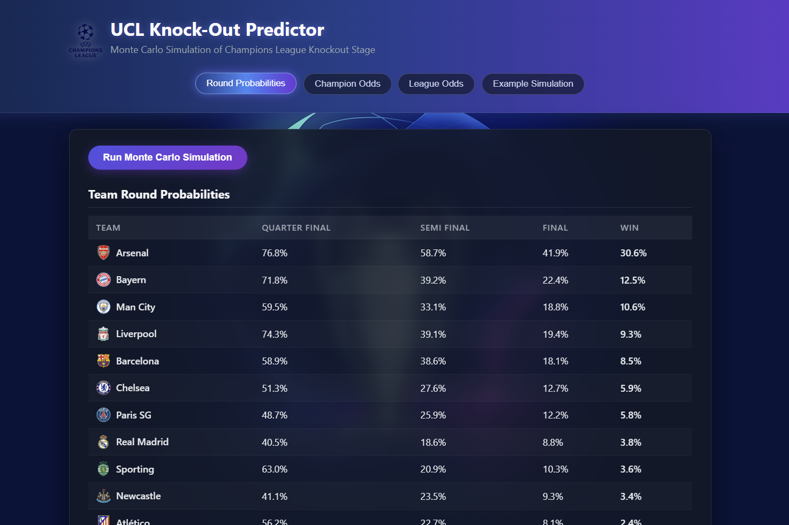
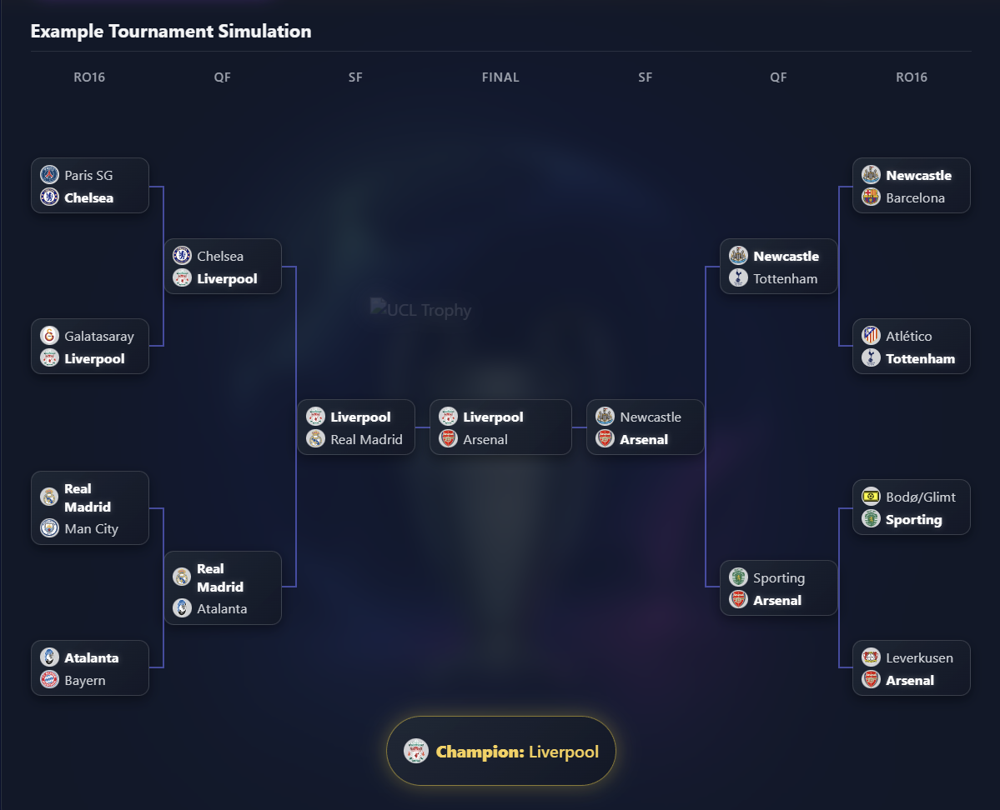
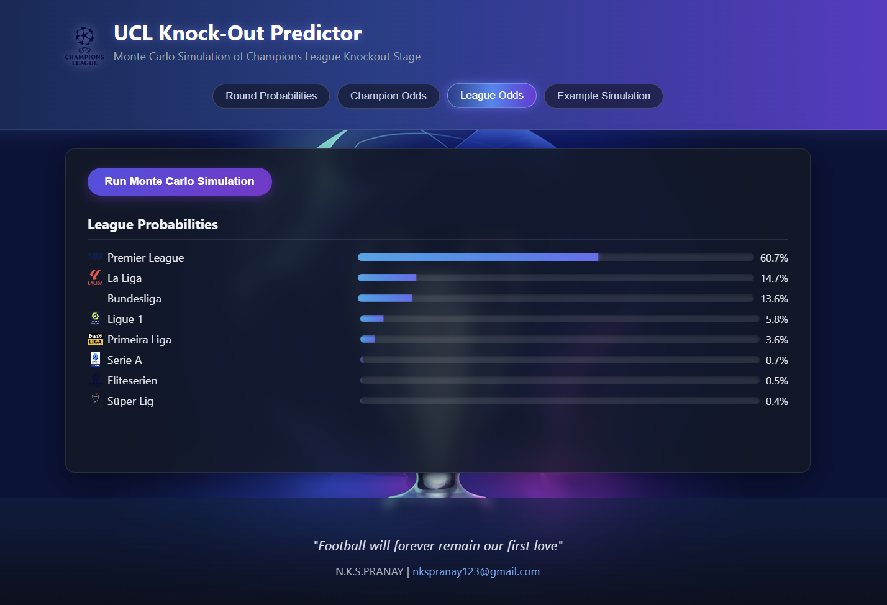
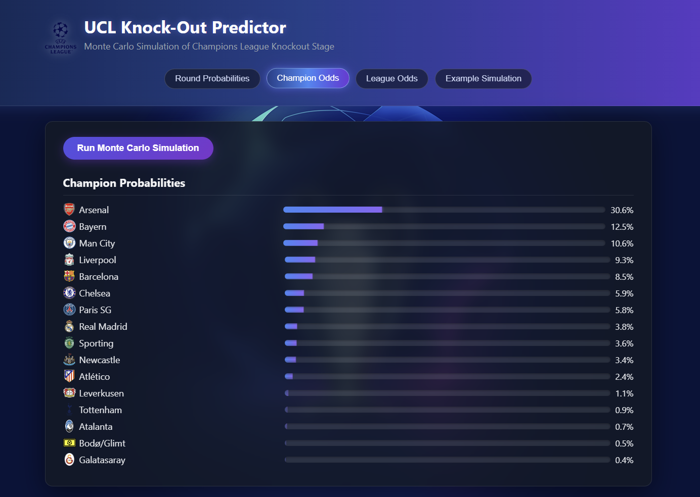

# UCL Knock-Out Predictor

A Monte Carlo simulation engine that predicts the outcome probabilities of the **UEFA Champions League knockout stage**.

The project simulates the entire tournament thousands of times using a probabilistic match model to estimate each team's chances of reaching every round and winning the competition.

## Live Demo

Frontend:
https://ucl-knock-out-predictor.vercel.app

Backend API:
https://ucl-knock-out-predictor.onrender.com/docs

## Screenshots

### Dashboard

### Simulation Results

### League Winners

### Team Probabilities

## Features

- Monte Carlo tournament simulation
- Elo-style match probability model
- Full knockout bracket simulation
- Probability of reaching:
  - Quarter-finals
  - Semi-finals
  - Final
  - Champion
- FastAPI backend API
- Lightweight React frontend visualization
- Clean, responsive UI with UCL-themed styling

## Tech Stack

### Backend
- Python
- FastAPI
- Monte Carlo Simulation

### Frontend
- React
- Vite
- CSS

## How It Works

1. Each match is simulated using a probability model based on team strength.
2. A full knockout bracket is simulated.
3. The tournament is simulated **thousands of times**.
4. Results are aggregated to estimate probabilities for each team.

This produces probabilities such as:

Manchester City — 34.2% chance to win
Real Madrid — 22.5% chance to win
Bayern Munich — 18.1% chance to win

## Running the Project Locally

### 1. Start the Backend

uvicorn api.main:app --reload

Backend will run at:

http://127.0.0.1:8000

### 2. Start the Frontend

npm install
npm run dev

Frontend runs at:

http://localhost:5173

## Project Structure

UCL-Knock-Out-Predictor-
│
├── api
├── knockout
├── match_engine
├── visualization
│
├── src
│ ├── assets
│ ├── App.jsx
│ ├── App.css
│ └── main.jsx
│
├── public
│ └── favicon.png
│
├── index.html
├── package.json
└── README.md

## Purpose

This project demonstrates:

- Algorithmic problem solving
- Monte Carlo simulations
- API design
- Full-stack integration

Built as a **sports analytics + software engineering project**.